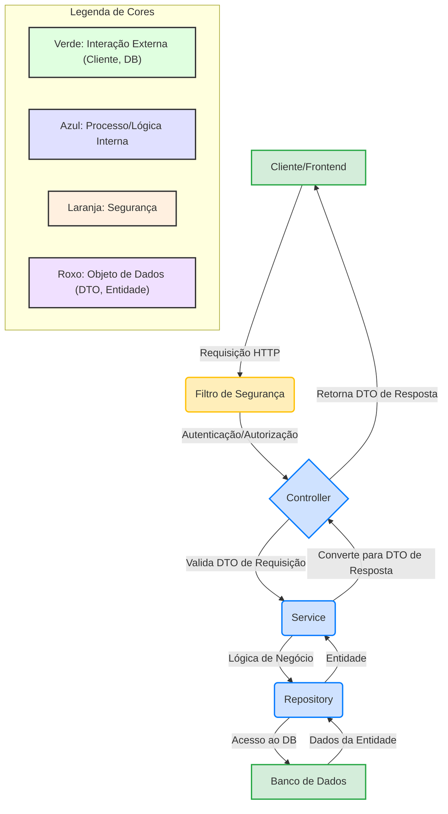
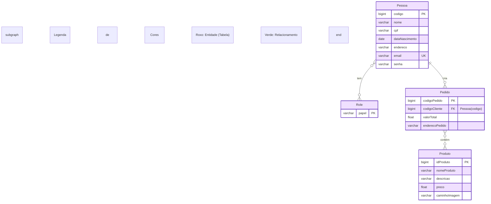
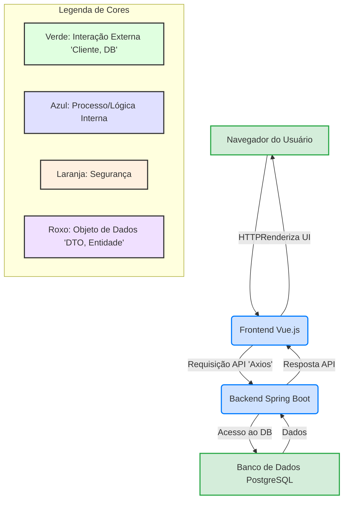

# Delivery System

## Visão Geral do Projeto

Este projeto é um sistema completo de delivery, composto por um **backend API RESTful** (Spring Boot) e um **frontend básico** (Vue.js). Ele gerencia produtos, usuários e pedidos, fornecendo uma solução integrada para um marketplace de delivery.

## Funcionalidades Principais

### Backend (API RESTful)

*   **Gestão de Produtos:**
    *   Criação, leitura, atualização e exclusão (CRUD) de produtos.
    *   Upload de imagens de produtos associadas.
*   **Gestão de Usuários:**
    *   Registro de novos usuários (com role `USER` padrão).
    *   Atualização de dados do próprio perfil.
    *   Autenticação e autorização baseadas em roles (`ADMIN`, `USER`).
    *   Criação de usuários e roles padrão na inicialização da aplicação (`admin@example.com` / `admin123`, `user@example.com` / `user123`).
*   **Gestão de Pedidos:**
    *   Criação de pedidos com múltiplos produtos.
    *   Listagem de histórico de pedidos por usuário.
    *   Listagem de todos os pedidos (para administradores).
*   **Segurança:**
    *   Autenticação HTTP Basic.
    *   Autorização baseada em roles para acesso a endpoints específicos.
    *   Configuração CORS para permitir comunicação com o frontend.
*   **Documentação Interativa:**
    *   Documentação automática da API via Swagger UI (OpenAPI).

### Frontend (Vue.js)

*   **Páginas:** Login, Registro, Listagem de Produtos, Carrinho de Compras.
*   **Interação com API:** Consome os endpoints do backend para autenticação, registro, listagem de produtos e criação de pedidos.
*   **Gerenciamento de Estado:** Carrinho de compras gerenciado localmente no navegador.
*   **Estilização:** Utiliza Bootstrap para um design responsivo e funcional.

## Tecnologias Utilizadas

| Componente | Tecnologia           | Versão           | Descrição                                                              |
| :--------- | :------------------- | :--------------- | :--------------------------------------------------------------------- |
| **Backend**| **Java**             | 22               | Linguagem de programação principal.                                    |
|            | **Spring Boot**      | 3.3.2            | Framework para desenvolvimento rápido de aplicações Java.              |
|            | **Maven**            | 3.9.6            | Ferramenta de automação de build e gerenciamento de dependências.      |
|            | **Spring Data JPA**  | 3.3.2            | Para persistência de dados e interação com o banco de dados.           |
|            | **PostgreSQL**       | (Driver)         | Banco de dados relacional.                                             |
|            | **Spring Security**  | 6.x              | Para autenticação e autorização.                                       |
|            | **SpringDoc OpenAPI**| 2.5.0            | Geração automática de documentação OpenAPI (Swagger UI).               |
|            | **Commons FileUpload**| 1.5             | Para manipulação de upload de arquivos.                                |
|            | **Commons IO**       | 2.16.1           | Utilitários de I/O.                                                    |
| **Frontend**| **Vue.js**           | 3.x              | Framework JavaScript progressivo para construção de interfaces.        |
|            | **Vue Router**       | 4.x              | Para gerenciamento de rotas no frontend.                               |
|            | **Axios**            | 1.x              | Cliente HTTP baseado em Promises para o navegador e Node.js.           |
|            | **Bootstrap**        | 5.3.3            | Framework CSS para estilização responsiva.                             |
| **Geral**  | **Docker**           | Latest           | Para containerização e orquestração de ambos os serviços.              |

## Arquitetura do Projeto

O projeto é dividido em dois microsserviços principais (backend e frontend) orquestrados via Docker Compose, interagindo através de uma API RESTful.

### Backend (API RESTful)

Segue uma arquitetura em camadas, com foco em princípios de design limpo:

*   **`controller`**: Camada de interface da API. Recebe requisições HTTP, valida DTOs de entrada, chama os serviços e retorna DTOs de resposta. Não contém lógica de negócio.
*   **`service`**: Camada de lógica de negócio. Contém as regras de negócio, orquestra operações e interage com a camada de repositório.
*   **`repository`**: Camada de acesso a dados. Interage diretamente com o banco de dados via Spring Data JPA.
*   **`model`**: Camada de entidades JPA. Representa a estrutura do banco de dados.
*   **`dto`**: Data Transfer Objects. Classes usadas para transferir dados entre as camadas da API (controller <-> service) e para definir o contrato da API, desacoplando-a das entidades do banco de dados.
*   **`mapper`**: Classes responsáveis por converter entre entidades e DTOs.
*   **`config`**: Classes de configuração da aplicação, incluindo segurança e CORS.
*   **`security`**: Implementações relacionadas à segurança, como `UserDetailsService`.

### Fluxograma da Aplicação (Backend)

Este fluxograma ilustra o fluxo de uma requisição típica através das camadas do backend.



### Esquema do Banco de Dados (ERD Simplificado)

Este diagrama representa as principais entidades e seus relacionamentos no banco de dados.



## Estrutura de Pastas

```
.
├── backend-delivery/      # Contém o projeto Spring Boot (API RESTful)
│   ├── src/main/java/com/delivery/
│   │   ├── config/         # Configurações da aplicação (e.g., SecurityConfig, CORS)
│   │   ├── controller/     # Endpoints REST (ProdutoController, UsuarioController, PedidoController)
│   │   ├── dto/            # Data Transfer Objects (ProdutoRequestDTO, ProdutoResponseDTO, etc.)
│   │   ├── mapper/         # Classes para mapeamento entre Entidades e DTOs
│   │   ├── model/          # Entidades JPA (Pessoa, Produto, Pedido, Role)
│   │   ├── repository/     # Interfaces Spring Data JPA para acesso ao DB
│   │   ├── security/       # Implementação do UserDetailsService
│   │   └── service/        # Lógica de negócio (ProdutoService, PessoaService, PedidoService)
│   └── src/main/resources/
│       └── application.properties # Configurações da aplicação (DB, porta, upload dir)
├── frontend-delivery/     # Contém o projeto Vue.js (Frontend)
│   ├── public/             # Arquivos estáticos (index.html)
│   ├── src/                # Código fonte da aplicação Vue.js
│   │   ├── api.js          # Instância Axios para comunicação com o backend
│   │   ├── assets/         # Ativos estáticos (imagens, CSS)
│   │   ├── components/     # Componentes Vue reutilizáveis (e.g., AppNavbar.vue)
│   │   ├── router/         # Configuração do Vue Router
│   │   └── views/          # Componentes de página (e.g., AppHome.vue, AppLogin.vue)
│   └── Dockerfile          # Dockerfile para construir e servir o frontend
│   └── nginx.conf          # Configuração Nginx para servir o frontend
├── Dockerfile             # Dockerfile para construir o backend (usado pelo docker-compose)
├── docker-compose.yml     # Orquestração de backend, frontend e banco de dados
└── README.md              # Este arquivo de documentação
```

## Como Executar o Projeto

### Pré-requisitos

*   **Java Development Kit (JDK) 22** ou superior.
*   **Maven** (opcional, se for usar o `mvnw` do projeto).
*   **Node.js e npm** (para desenvolvimento frontend local).
*   **Docker Desktop** (para executar via Docker).

### 1. Configuração do Banco de Dados

O banco de dados PostgreSQL será provisionado via Docker Compose. As credenciais padrão são:
*   **Host:** `postgres-db` (dentro da rede Docker)
*   **Porta:** `5432`
*   **Nome do Banco:** `delivery_db`
*   **Usuário:** `postgres`
*   **Senha:** `password`

Essas configurações já estão refletidas em `backend-delivery/src/main/resources/application.properties` e `docker-compose.yml`.

### 2. Executando Localmente (Apenas Backend)

Navegue até o diretório `backend-delivery` no seu terminal:

```bash
cd backend-delivery
```

Execute a aplicação Spring Boot:

```bash
./mvnw spring-boot:run
```

### 3. Executando Localmente (Apenas Frontend)

Navegue até o diretório `frontend-delivery` no seu terminal:

```bash
cd frontend-delivery
```

Instale as dependências (se ainda não o fez):

```bash
npm install
```

Execute a aplicação Vue.js:

```bash
npm run serve
```

O frontend estará acessível em `http://localhost:8080` (ou outra porta que o Vue CLI indicar, geralmente 8080 ou 8081).

### 4. Executando com Docker Compose (Recomendado)

Esta é a forma recomendada de executar o sistema completo, pois orquestra o backend, frontend e banco de dados.

1.  **Navegue até a raiz do projeto** (onde o `Dockerfile` e `docker-compose.yml` estão localizados):

    ```bash
    cd D:/Github/delivery_system/ # ou o caminho da raiz do seu projeto
    ```

2.  **Limpe o ambiente e reconstrua as imagens (para garantir um estado limpo):**

    ```bash
    docker-compose down -v
    docker-compose build --no-cache
    ```

3.  **Execute os contêineres:**

    ```bash
    docker-compose up
    ```

    *   O **Backend** estará acessível internamente na rede Docker em `backend-app:8080` e externamente em `http://localhost:8080`.
    *   O **Frontend** estará acessível em `http://localhost/` (mapeado para a porta 80 do seu host).

## Acessando a Aplicação e API

*   **Frontend:** Acesse `http://localhost/` no seu navegador.
*   **Backend API (Swagger UI):** Acesse `http://localhost:8080/swagger-ui.html` para a documentação interativa da API.

### Credenciais Padrão (criadas na inicialização do Backend)

*   **Administrador:**
    *   **Email:** `admin@example.com`
    *   **Senha:** `admin123`
*   **Usuário Comum:**
    *   **Email:** `user@example.com`
    *   **Senha:** `user123`

## Fluxo de Comunicação (Frontend e Backend)



## Log de Alterações (`log.md`)

Para um histórico detalhado de todas as modificações, erros e correções, consulte o arquivo `log.md` na raiz do projeto.