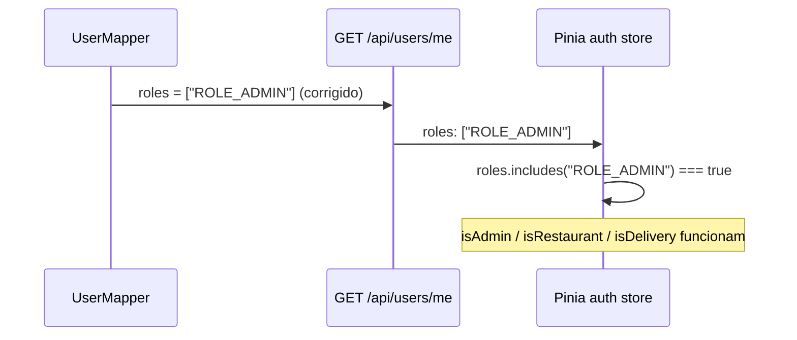

# Correcoes de Entrega (Delivery)

## BUG-01: Roles sem prefixo ROLE_

**Arquivo:** `backend/src/main/java/com/delivery/mapper/UserMapper.java`

O metodo `mapRoles` usava `role.getName()` que devolve `"ADMIN"` em vez de `role.getAuthority()` que devolve `"ROLE_ADMIN"`. O frontend (`stores/auth.js`, `router/guards.js`) espera o prefixo.

**Correcao:** `role -> role.getAuthority()` em vez de `role -> role.getName()`.

---

## BUG-02/03/04: DeliveryDashboard.vue quebrado

**Arquivo:** `frontend/src/views/DeliveryDashboard.vue`

Problemas corrigidos:
1. **Path errado:** `/entregas/disponiveis` -> `/api/deliveries/available` (e同理 os demais)
2. **Variavel `novoStatus` indefinida:** era `{ novoStatus }` no corpo da requisicao, mas o backend espera `?status=` como query param. Agora envia como query param: `api.put(\`/api/deliveries/${deliveryId}/status?status=${newStatus}\`)`
3. **Campos inexistentes:** `codigoPedido`, `enderecoOrigem`, `enderecoDestino`, `valorEntrega` substituidos por `orderId`, `originAddress`, `destinationAddress`, `fee`

---

## BUG-05/06: RestaurantDashboard.vue

**Arquivo:** `frontend/src/views/RestaurantDashboard.vue`

1. **Import errado:** `@/components/ProductFormModal.vue` -> `@/components/features/product/ProductFormModal.vue`
2. **Props incompativeis:** `:visible` e `@close` substituidos por `v-model`
3. **Nomes de campo em PT:** `nome`, `endereco`, `idProduto`, `nomeProduto`, `descricao`, `preco`, `caminhoImagem` -> `name`, `address`, `id`, `name`, `description`, `price`, `imageUrl`
4. **Metodos `handleProductSave` e `deleteProduct`** ajustados para usar nomes de campo em ingles e endpoint PUT com suporte a multipart

---

## BUG-07: DeliveryTracker.vue com status errados

**Arquivo:** `frontend/src/components/features/delivery/DeliveryTracker.vue`

Os valores do array `deliverySteps` estavam em ingles (`PENDING`, `ACCEPTED`, `PICKED_UP`, `IN_TRANSIT`, `DELIVERED`), mas o enum `DeliveryStatus` do backend e em portugues (`PENDENTE`, `ACEITA`, `COLETADA`, `EM_ROTA`, `ENTREGUE`). Os rotulos de exibicao continuam em portugues.

---

## BUG-12: RestExceptionHandler sem mapeamento de excecoes de autenticacao

**Arquivo:** `backend/src/main/java/com/delivery/exception/RestExceptionHandler.java`

Adicionaram-se handlers especificos:
- `AuthenticationException` / `BadCredentialsException` -> 401 UNAUTHORIZED
- `SecurityException` / `AccessDeniedException` -> 403 FORBIDDEN
- `IllegalArgumentException` -> 400 BAD_REQUEST
- `IllegalStateException` -> 409 CONFLICT

O handler de `MethodArgumentNotValidException` agora retorna o formato padrao `ApiError` com campo `errors` opcional, em vez de um `Map` simples.

---

## BUG-13: Erro de validacao em formato inconsistente

Resolvido pelo mesmo handler acima: a resposta de `MethodArgumentNotValidException` agora inclui `message`, `status`, `timestamp` e `errors` (formato padrao do `ApiError`).

---

## BUG-14: Edicao de produto sem suporte a imagem

**Arquivos alterados:**
- `backend/src/main/java/com/delivery/controller/ProductController.java`
- `backend/src/main/java/com/delivery/service/ProductService.java`
- `backend/src/main/java/com/delivery/controller/RestauranteController.java`

O endpoint `PUT /api/products/{id}` agora aceita `multipart/form-data` com os campos `data` (JSON) e `image` (arquivo opcional). Se uma nova imagem for fornecida, a anterior e removida via `FileStorageService.delete()`.

---

## BUG-15: Atualizacao de perfil ignorava email

**Arquivo:** `backend/src/main/java/com/delivery/service/UserService.java`

Adicionou-se logica para atualizar o email quando diferente do atual, validando unicidade antes.

---

## BUG-17: Consolidacao RestauranteController

**Arquivo:** `backend/src/main/java/com/delivery/controller/RestauranteController.java`

Os endpoints POST/PUT de produto agora aceitam `multipart/form-data` (compativel com `ProductController`), mudando de `@RequestBody` para `@RequestPart`.

---

## BUG-18: BaseInput.vue ignorava type=textarea

**Arquivo:** `frontend/src/components/base/BaseInput.vue`

Adicionou-se renderizacao condicional para `<textarea>` quando `type === 'textarea'`, permitindo que o campo de descricao de produto seja multilinha.

---

## CODE-01: @Data removido de entidades JPA

**Arquivos alterados:**
- `Order.java`
- `Delivery.java`
- `User.java`
- `Establishment.java`
- `Product.java`
- `Payment.java`

Substituiu-se `@Data` por `@Getter @Setter @EqualsAndHashCode(of = "id") @ToString(exclude = {relacionamentos})` em todas as entidades com relacionamento bidirecional, eliminando o risco de `StackOverflowError` em `toString()`/`equals()`/`hashCode()`.

---

## CODE-09: Revogacao de ObjectURL

**Arquivo:** `frontend/src/components/features/product/ProductFormModal.vue`

Adicionou-se `URL.revokeObjectURL()` ao trocar de arquivo, evitando vazamento de memoria.

---

## CODE-10: URLs hardcoded

Nao corrigido integralmente (escopo grande). O `AdminDashboard.vue` ainda tem `http://localhost:8080` hardcoded. Recomendacao futura: criar `src/config/env.js` centralizando `VITE_APP_BACKEND_URL`.
