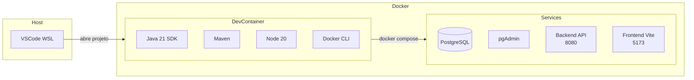
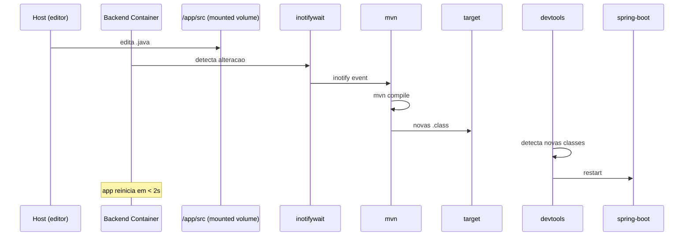

# Infraestrutura Docker e Dev Container

## INFRA-01: Projeto executado exclusivamente via Docker

Todas as dependencias (Java 21, Maven, Node 20, npm) foram removidas da maquina host.
O desenvolvimento e a execucao agora sao 100% Docker.



**Arquivos criados:**
- `.devcontainer/Dockerfile` — Java 21 + Maven + Node 20
- `.devcontainer/devcontainer.json` — Extensoes VSCode, Docker socket, settings

---

## INFRA-02: Backend Dockerfile.dev com hot-reload

**Arquivos criados:**
- `infra/docker/backend/Dockerfile.dev`
- `backend/scripts/dev-entrypoint.sh`

O Dockerfile.dev instala Maven e `inotify-tools`, copia o pom.xml para cache de
dependencias via `mvn dependency:go-offline`, e copia o entrypoint.

O entrypoint (`dev-entrypoint.sh`) executa:
1. `mvn compile` — compilacao inicial
2. `mvn spring-boot:run` — inicia o app com `spring-boot-devtools`
3. `inotifywait` em loop — detecta alteracoes em `src/` e executa `mvn compile`

O `spring-boot-devtools` detecta as novas classes compiladas e reinicia
automaticamente a aplicacao.

```
Dockerfile.dev
├── FROM eclipse-temurin:21-jdk-alpine
├── RUN apk add --no-cache maven inotify-tools
├── COPY pom.xml .
├── RUN mvn dependency:go-offline -B
├── COPY src src
├── COPY scripts/dev-entrypoint.sh /app/dev-entrypoint.sh
├── EXPOSE 8080
└── ENTRYPOINT ["/app/dev-entrypoint.sh"]
```



---

## INFRA-03: Frontend Dockerfile.dev com Vite HMR

**Arquivo:** `infra/docker/frontend/Dockerfile.dev`

Baseado em `node:20-alpine`, o container executa `npm run dev` com `--host 0.0.0.0`.
O Vite ja possui HMR nativo — alteracoes no codigo refletem no browser em
milissegundos sem recarregar a pagina.

```dockerfile
FROM node:20-alpine
WORKDIR /app
COPY package*.json ./
RUN npm ci
COPY . .
EXPOSE 5173
CMD ["npm", "run", "dev"]
```

---

## INFRA-04: docker-compose.yml para desenvolvimento

**Arquivo:** `infra/docker-compose.yml`

Substituiu o `docker-compose.yml` anterior (orientado a producao) por uma
configuracao focada em desenvolvimento.

**Servicos:**

| Servico | Imagem/Dockerfile | Porta | Volume |
|---------|-------------------|-------|--------|
| db | postgres:16.6-alpine | 5432 | postgres_data |
| pgadmin | dpage/pgadmin4 | 5050 | - |
| backend | Dockerfile.dev | 8080 | src, pom.xml, uploads_data |
| frontend | Dockerfile.dev | 5173 | src, index.html, vite.config.js |

**Variaveis de ambiente:**
- `env_file: ../.env` — carrega do `.env` na raiz do projeto
- `environment` — valores explicitos para conexao com banco, JWT, CORS
- Variaveis do compose usam `${VAR:-default}` para fallback no `.env`

**Volumes:**
- `../backend/src:/app/src` — monta codigo fonte para hot-reload
- `../backend/pom.xml:/app/pom.xml` — permite adicionar dependencias sem rebuild
- `uploads_data` — persistencia de uploads
- `../frontend/src:/app/src` — monta codigo fonte Vue
- `/app/node_modules` — anonimo, preserva node_modules da imagem

---

## INFRA-05: docker-compose.prod.yml

**Arquivo:** `infra/docker-compose.prod.yml`

Configuracao para producao, usando:
- Dockerfile (backend) — multi-stage com JRE enxuta
- Dockerfile (frontend) — build + nginx estatico
- `SPRING_PROFILES_ACTIVE=prod`
- Rede exclusiva `delivery-network`
- Sem montagens de volume de codigo fonte

---

## INFRA-06: Configuracao centralizada (.env)

**Arquivos criados:**
- `.env` — valores default para dev local
- `.env.example` — template com todas as variaveis documentadas

**Variaveis centralizadas:**

```env
DATABASE_URL=jdbc:postgresql://localhost:5432/delivery_db
DATABASE_USERNAME=postgres
DATABASE_PASSWORD=password
JWT_SECRET=ZGV2U2VjcmV0S2V5Rm9ySldUU2lnbmluZ1B1cnBvc2VzMTIzNDU2Nzg5MA==
JWT_EXPIRATION_MS=86400000
CORS_ORIGINS=http://localhost:5173,http://127.0.0.1:5173
FRONTEND_URL=http://localhost:5173
SPRING_PROFILES_ACTIVE=dev
SERVER_PORT=8080
VITE_APP_API_BASE_URL=http://localhost:8080/api
VITE_APP_BACKEND_URL=http://localhost:8080
FILE_UPLOAD_DIR=uploads/
```

**Consumo:**
- **Backend:** `spring-dotenv:4.0.0` carrega `.env` do diretorio pai (`../.env`)
- **Frontend:** `envDir: '..'` no `vite.config.js` carrega `.env` da raiz
- **Docker:** `env_file: ../.env` no compose carrega no container

---

## INFRA-07: Varias profile properties usam env vars

**Arquivos alterados:**
- `application.properties` — `server.port=${SERVER_PORT}`, `spring.dotenv.location=../.env`
- `application-dev.properties` — substituiu hardcoded por `${VAR:default}`
- `application-prod.properties` — adicionado `CORS_ORIGINS`, padronizado `SERVER_PORT`

Antes o profile `dev` sobrescrevia valores hardcoded, impedindo que variaveis
de ambiente do `.env` fossem aplicadas. Agora ambos os profiles usam
`${VAR_NAME:default_value}`, permitindo que o `.env` tenha prioridade.

---

## INFRA-08: .dockerignore e .gitignore

**Arquivos criados:**
- `.dockerignore` — global: .git, node_modules, target, *.log
- `backend/.dockerignore` — target, *.log, uploads
- `frontend/.dockerignore` — node_modules, dist

**.gitignore atualizado:**
- Adicionado `.env`, `.env.local`, `.env.*.local`

---

## INFRA-09: spring-boot-devtools

**Arquivo:** `backend/pom.xml`

Adicionado `spring-boot-devtools` com `scope=runtime` e `optional=true`.
Trabalha em conjunto com o `dev-entrypoint.sh`: quando `mvn compile` gera novas
classes, o devtools detecta a mudanca e reinicia automaticamente a aplicacao.

---

## INFRA-10: Acessos

| Servico | URL | Credencial |
|---------|-----|------------|
| Frontend | http://localhost:5173 | - |
| Backend API | http://localhost:8080 | - |
| Swagger | http://localhost:8080/swagger-ui.html | - |
| pgAdmin | http://localhost:5050 | admin@delivery.com / admin |
| PostgreSQL | localhost:5432 | postgres / password |
