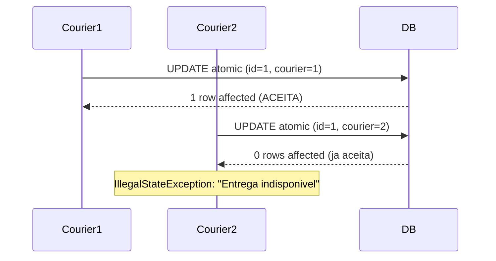

# Correcoes de Pagamento (Payment)

## SEC-06: Seguranca no fluxo PIX

Ja documentado em `docs/changes/seguranca.md`.

## BUG-10: OriginAddress na criacao da entrega

**Arquivo:** `backend/src/main/java/com/delivery/service/OrderService.java`

Ao criar um pedido, a `Delivery` agora recebe `originAddress` extraido do endereco do `Establishment` do primeiro produto do pedido. Antes esse campo ficava sempre nulo.

```mermaid
flowchart LR
    createOrder -->|busca produtos| List<Product>
    List<Product> -->|primeiro produto| establishment
    establishment -->|getAddress| originAddress
    originAddress --> Delivery.builder
```

---

## BUG-16: Condicao de corrida em acceptDelivery

**Arquivos alterados:**
- `backend/src/main/java/com/delivery/repository/DeliveryRepository.java`
- `backend/src/main/java/com/delivery/service/DeliveryService.java`

Antes: duas threads podiam ler `status == PENDENTE` simultaneamente e ambas aceitar a mesma entrega.

Depois: usa-se uma query atomica `UPDATE Delivery SET status = 'ACEITA', courier = :courier WHERE id = :id AND status = 'PENDENTE' AND courier IS NULL`. O metodo `acceptAtomically` retorna o numero de linhas afetadas (0 ou 1). Se for 0, significa que outro entregador ja aceitou, lancando `IllegalStateException`.



---

## PERF-01: N+1 queries em OrderRepository

**Arquivo:** `backend/src/main/java/com/delivery/repository/OrderRepository.java`

Adicionou-se `@EntityGraph(attributePaths = {"products", "delivery"})` no metodo `findByCustomerId` para evitar N+1 ao listar pedidos.

---

## PERF-02: Indices e FK faltantes

**Arquivo:** `backend/src/main/resources/db/migration/V2__add_indexes.sql`

Nova migration Flyway adicionando:
- `idx_orders_customer_id` + FK de `orders.customer_id` para `users.id`
- `idx_deliveries_courier_id` para buscas por entregador
- `idx_deliveries_status` composto para filtrar entregas disponiveis
- `idx_products_establishment_id` para produtos por estabelecimento
- `idx_payments_transaction_id` unico para confirmacao de pagamento
- Indices em `user_roles.user_id` e `user_roles.role_name`

---

## PERF-04: Read-only transactions

Adicionou-se `@Transactional(readOnly = true)` em metodos de leitura nos services:
- `UserService.findByEmail`
- `DeliveryService.listAvailable`
- `DeliveryService.listMyDeliveries`
- `ProductService.listAll`, `listMyProducts`, `listByEstablishment`, `findById`

---

## BUG-08/09: Sincronizacao Order.status com Delivery.status

**Arquivo:** `backend/src/main/java/com/delivery/service/DeliveryService.java`

Em `updateStatus`, quando o novo status da entrega for `ENTREGUE`, agora tambem atualiza `order.setStatus("DELIVERED")` e persiste a ordem.

**Arquivo:** `frontend/src/views/AppOrders.vue`

Removeu-se a linha `orders.value[index].status = deliveryUpdate.status` que sobrescrevia o status do pedido com o status da entrega (ex: `"ACEITA"` dentro de um campo que deveria ser `"PAID"`).
