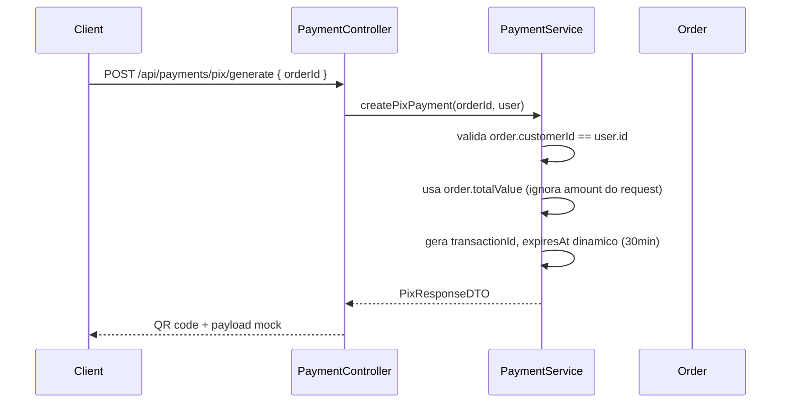
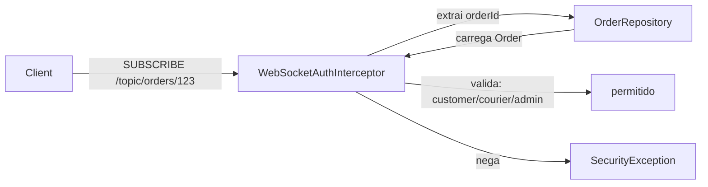

# Correcoes de Seguranca (SEC)

## SEC-01: Secret JWT sem fallback em producao

**Arquivo:** `backend/src/main/resources/application-prod.properties`

Removeu-se o valor default do `app.jwt.secret` para que a aplicacao falhe ao iniciar em producao se `JWT_SECRET` nao for definida como variavel de ambiente.

```properties
app.jwt.secret=${JWT_SECRET}
```

---

## SEC-02: DataLoader restrito ao profile dev

**Arquivo:** `backend/src/main/java/com/delivery/config/DataLoader.java`

Adicionou-se `@Profile("dev")` para que a classe so execute no perfil de desenvolvimento. Em producao, nenhum usuario admin padrao ou lojista ficticio e criado automaticamente.

---

## SEC-03: CORS usando a propriedade configurada

**Arquivo:** `backend/src/main/java/com/delivery/config/SecurityConfig.java`

O metodo `corsConfigurationSource` agora usa `allowedOrigins` (injetado de `app.cors.allowed-origins`) em vez do hardcoded `["*"]`. Se houver um `*` na lista, usa `setAllowedOriginPatterns`; caso contrario, usa `setAllowedOrigins`. Isso preserva compatibilidade com wildcards quando necessario, mas respeita a configuracao.

---

## SEC-04: Log e Actuator seguros

**Arquivo:** `backend/src/main/resources/application.properties`

Removeu-se `logging.level.org.springframework.security=TRACE` e alterou-se `management.endpoints.web.exposure.include=*` para `health,info`.

---

## SEC-05: Upload sanitizado com FileStorageService

**Arquivos criados:**
- `backend/src/main/java/com/delivery/service/FileStorageService.java` (interface)
- `backend/src/main/java/com/delivery/service/LocalFileStorageService.java` (implementacao)

**Arquivo alterado:**
- `backend/src/main/java/com/delivery/service/ProductService.java`

A interface `FileStorageService` abstrai o armazenamento de arquivos, permitindo futura troca para Cloudinary ou S3 sem modificar `ProductService`. A implementacao `LocalFileStorageService`:

1. Gera nome UUID + extensao derivada do content-type real (nunca reusa `getOriginalFilename()`)
2. Valida content-type contra whitelist (`image/png`, `image/jpeg`, `image/webp`)
3. Limita tamanho a 5MB
4. Normaliza o path e detecta path traversal
5. Suporte a `delete()` para limpeza ao remover/atualizar produtos

O endpoint PUT de produto agora aceita multipart (BUG-14), permitindo trocar a imagem na edicao.

```mermaid
flowchart LR
    Client -->|POST multipart| ProductController
    ProductController --> ProductService
    ProductService -->|store()| FileStorageService
    ProductService -->|delete()/store()| FileStorageService
    FileStorageService --> LocalFileStorageService
    LocalFileStorageService -->|valida tipo/tamanho| Filesystem
```

Configuracao adicionada em `application.properties`:
```properties
spring.servlet.multipart.max-file-size=5MB
spring.servlet.multipart.max-request-size=10MB
```

---

## SEC-06: Pagamento PIX com validacao de propriedade e valor

**Arquivos alterados:**
- `backend/src/main/java/com/delivery/controller/PaymentController.java`
- `backend/src/main/java/com/delivery/service/PaymentService.java`

Antes: `orderId` e `amount` vinham diretamente do cliente, permitindo IDOR e adulteracao de valor.

Depois:



- `generatePix` agora usa `SecurityService.getAuthenticatedUser()` para validar que `order.customerId` e o usuario autenticado
- O valor usado e `order.getTotalValue()` (calculado no backend), nao o `amount` enviado pelo cliente
- `expiresAt` e calculado dinamicamente (`LocalDateTime.now().plusMinutes(30)`)
- `getStatus` agora valida que o pagamento pertence ao usuario autenticado (ou o usuario e admin)
- O QR code e payload PIX continuam sendo mock (apenas para demonstracao), mas agora explicitamente marcados como constantes `MOCK_QR_CODE` e `MOCK_COPY_PASTE`

---

## SEC-07: Autorizacao em topicos WebSocket

**Arquivos criados:**
- `backend/src/main/java/com/delivery/security/WebSocketAuthInterceptor.java`

**Arquivo alterado:**
- `backend/src/main/java/com/delivery/config/WebSocketConfig.java`

Adicionou-se um `ChannelInterceptor` que intercepta frames `SUBSCRIBE` e valida:

1. Se o destino e `/topic/orders/{orderId}`, extrai o `orderId` e carrega o `Order`
2. Verifica se o usuario autenticado e o `customerId` do pedido, o `courierId` da entrega, ou um admin
3. Se nao atender, lanca `SecurityException`

Topicos `/queue/*` (destinos por usuario) sao permitidos sem restricao adicional.



---

## SEC-09: Validacao de CPF com algoritmo de digitos verificadores

**Arquivo:** `backend/src/main/java/com/delivery/domain/valueobject/Cpf.java`

Substituiu-se a validacao simplista (apenas 11 digitos numericos) pelo algoritmo oficial de calculo dos digitos verificadores:
- Rejeita CPFs com todos os digitos iguais (ex: `11111111111`)
- Calcula primeiro digito verificador (10 digitos iniciais)
- Calcula segundo digito verificador (11 digitos iniciais)
- Lanca `IllegalArgumentException` se qualquer digito nao conferir

## SEC-10: Politica de senha no backend

**Arquivo:** `backend/src/main/java/com/delivery/dto/UserRequestDTO.java`

Adicionou-se `@Size(min = 8)` no campo `password` da `UserRequestDTO`, garantindo que o backend tambem exija senha de no minimo 8 caracteres (nao apenas o frontend).

---

## CODE-03: Validacao declarativa em DTOs

**Arquivos alterados:**
- `backend/src/main/java/com/delivery/dto/ProductRequestDTO.java`
- `backend/src/main/java/com/delivery/dto/EstablishmentRequestDTO.java`
- `backend/src/main/java/com/delivery/dto/DeliveryRequestDTO.java`
- `backend/src/main/java/com/delivery/dto/LoginRequestDTO.java`
- `backend/src/main/java/com/delivery/dto/OrderRequestDTO.java`

Adicionaram-se anotacoes `@NotBlank`, `@NotNull`, `@Positive`, `@NotEmpty`, `@Email` conforme a natureza de cada campo, garantindo validacao na borda da API e melhor documentacao OpenAPI.
