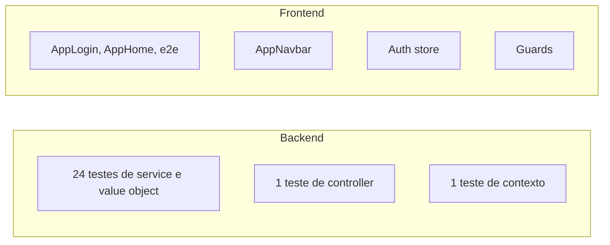

# Correcoes de Testes

## Testes criados/atualizados durante as correcoes

### Testes de seguranca e mapeamento

Os seguintes testes foram atualizados para refletir as correcoes estruturais:

1. **ProductServiceTest.java** - Atualizado para injetar `FileStorageService` (nova dependencia) e para usar a nova assinatura de `updateProduct(id, dto, image)`.
2. **DeliveryServiceTest.java** - Refatorado para testar o novo metodo atomico `acceptAtomically()`:
   - `shouldAcceptDelivery`: verifica aceite bem-sucedido
   - `shouldThrowWhenDeliveryAlreadyAccepted`: verifica que `IllegalStateException` e lancada quando 0 linhas sao afetadas
3. **CpfTest.java** - Atualizado para usar CPFs que passam o algoritmo de digito verificador (`52998224725` em vez de `12345678901`), e adiciona casos de teste para CPFs com todos digitos iguais (`11111111111`, `00000000000`) que agora sao rejeitados
4. **UserServiceTest.java** - Atualizado para usar CPF valido (`52998224725`) e senha com tamanho minimo (`password123`)

### Cobertura atual

**Backend (24 testes):** 
- `CpfTest` (9) - validacao com checksum
- `EmailTest` (6) - validacao de formato
- `DeliveryServiceTest` (2) - aceite atomico
- `ProductServiceTest` (2) - CRUD com FileStorage
- `UserServiceTest` (1) - criacao de usuario
- `OrderServiceTest` (1) - criacao de pedido
- `EstablishmentServiceTest` (1) - busca
- `OrderControllerTest` (1) - criacao via controller
- `DeliveryApplicationTests` (1) - contexto

**Frontend (19 testes):**
- `AppNavbar.test.js` (5)
- `AppLogin.test.js` (3)
- `e2e.test.js` (1)
- `stores/auth.test.js` (4)
- `AppHome.test.js` (2)
- `router/guards.test.js` (4)

### Lacunas identificadas (Phase 5 - proxima iteracao)

| ID | O que falta |
|---|---|
| TEST-01 | `PaymentService`, `PaymentController` - fluxo PIX completo |
| TEST-02 | `JwtTokenProvider`, `JwtAuthenticationFilter`, `AuthController` |
| TEST-03 | `RestExceptionHandler` - um teste por tipo de excecao |
| TEST-04 | Mappers MapStruct com implementacao real (`UserMapper`, `ProductMapper`, etc.) |
| TEST-06 | Caminhos de falha: email duplicado, CPF invalido, entrega ja aceita |
| TEST-07 | `OrderServiceTest` - verificar valores calculados com `ArgumentCaptor` |
| TEST-08 | `ProductService.createProduct` com imagem, `DeliveryController`, `EstablishmentController`, `UserController` |
| TEST-09 | Frontend: `AppCart`, `DeliveryDashboard`, `AdminDashboard`, `ProductFormModal` |
| TEST-10 | `@DataJpaTest` para repositorios (`OrderRepository`, `DeliveryRepository`) |
| TEST-11 | Teste de concorrencia para `acceptDelivery` |
