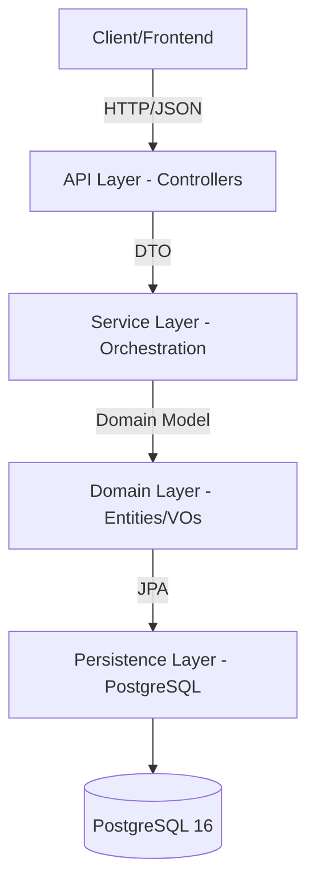
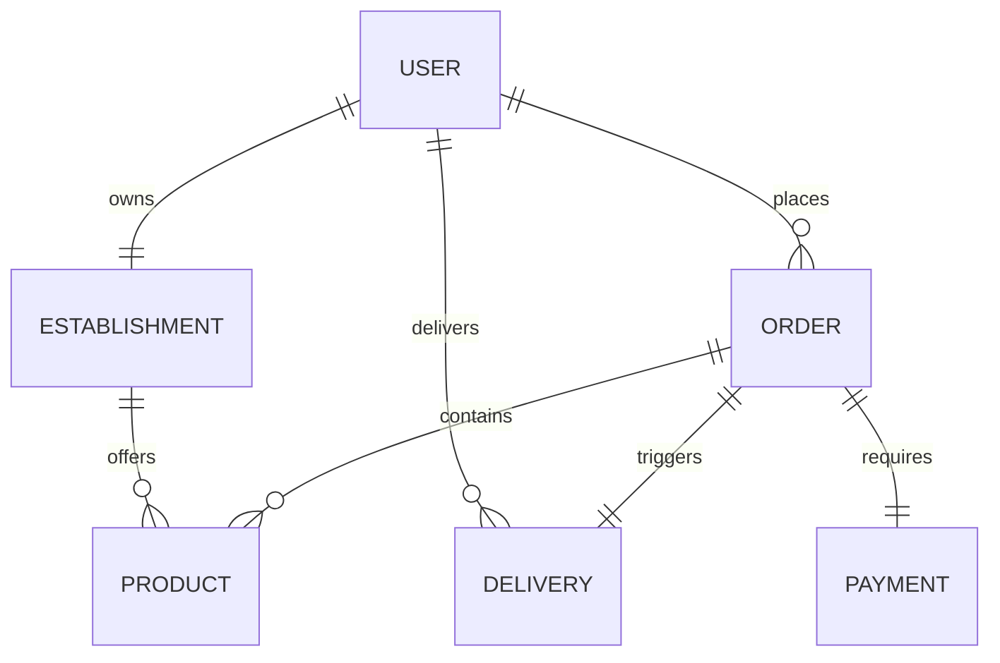

# System Architecture - Delivery System

## 1. Architectural Overview
The system is built on a **Layered Architecture** with **Domain-Driven Design (DDD)** influences. It prioritizes the decoupling of business logic from infrastructure and API contracts.

### 1.1. High-Level Flow

## 2. Layers Detail

### 2.1. API Layer (Controllers)
- **Responsibility:** Handle HTTP requests, validate incoming Data Transfer Objects (DTOs), and return standardized responses.
- **Components:** `UserController`, `OrderController`, `ProductController`, etc.

### 2.2. Service Layer (Application)
- **Responsibility:** Orchestrate business use cases. It interacts with multiple repositories and manages transactions.
- **Transaction Strategy:** `@Transactional` is used here to ensure atomic operations.

### 2.3. Domain Layer (Core)
- **Entities:** Rich objects containing logic (e.g., `Order.calculateTotal()`).
- **Value Objects (VOs):** Immutable objects with self-validation (`Cpf`, `Email`).
- **Logic:** Business rules stay here, not in Services.

### 2.4. Persistence Layer (Repositories)
- **Technology:** Spring Data JPA.
- **Responsibility:** Abstract database access.

## 3. Database Schema (ER Diagram)

## 4. Technology Stack
- **Runtime:** Java 21 (Virtual Threads enabled for high concurrency).
- **Framework:** Spring Boot 3.4.1.
- **Security:** Spring Security + Stateless JWT.
- **Mapping:** MapStruct 1.6.3 (Strict DTO/Entity isolation).