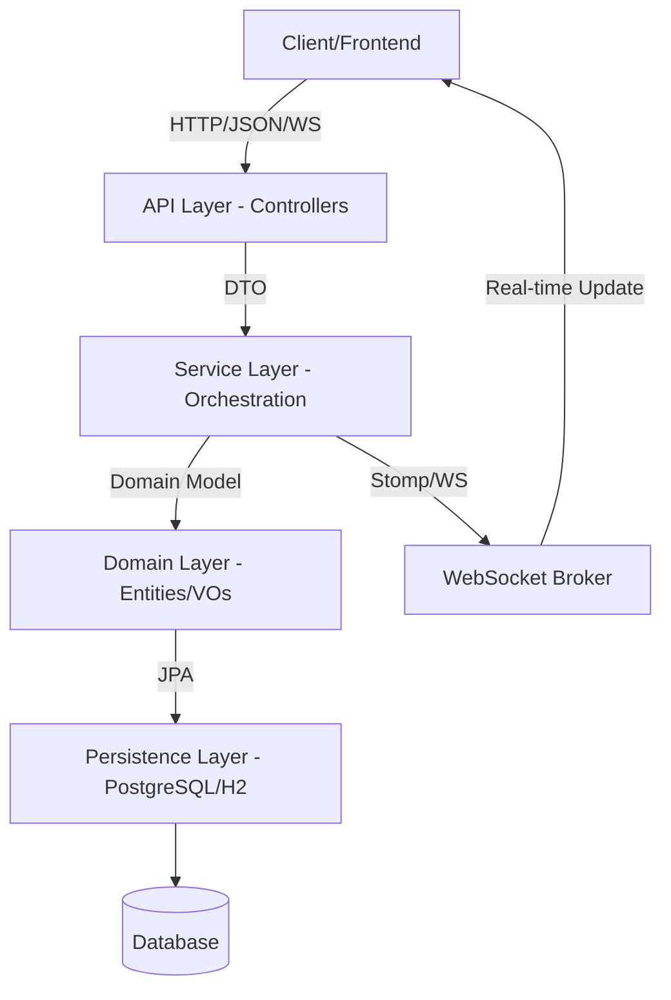
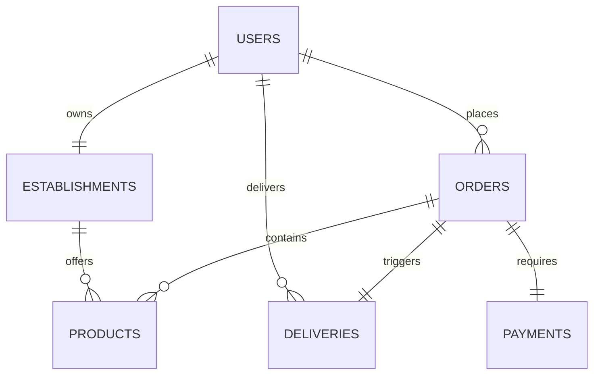

# System Architecture - Delivery System

## 1. Architectural Overview
The system is built on a **Layered Architecture** with **Domain-Driven Design (DDD)** influences. It prioritizes the decoupling of business logic from infrastructure and API contracts.

### 1.1. High-Level Flow

## 2. Layers Detail

### 2.1. API Layer (Controllers)
- **Responsibility:** Handle HTTP requests and WebSocket connections, validate incoming Data Transfer Objects (DTOs), and return standardized responses.
- **Contract:** 100% English naming for endpoints and JSON keys.
- **Components:** `UserController`, `OrderController`, `ProductController`, `PaymentController`, `DeliveryController`.

### 2.2. Service Layer (Application)
- **Responsibility:** Orchestrate business use cases. It interacts with multiple repositories, manages transactions, and triggers real-time notifications via `SimpMessagingTemplate`.
- **Transaction Strategy:** `@Transactional` is used here to ensure atomic operations.

### 2.3. Domain Layer (Core)
- **Entities:** Rich objects containing logic (e.g., `Order.calculateTotal()`).
- **Value Objects (VOs):** Immutable objects with self-validation (`Cpf`, `Email`).
- **Logic:** Business rules stay here, not in Services.

### 2.4. Persistence Layer (Repositories)
- **Technology:** Spring Data JPA.
- **Responsibility:** Abstract database access. Supports PostgreSQL (Production) and H2 (Local Development).

## 3. Frontend Architecture (Vue.js 3)
The frontend follows a **Clean Frontend Architecture** pattern, organized in layers to ensure maintainability:

### 3.1. Layers
- **Services Layer (`/src/services`)**: The only layer that interacts with Axios. It encapsulates API calls and ensures the rest of the app receives standardized data.
- **Store Layer (`/src/stores`)**: Manages global state (Auth, Cart) using Pinia. It avoids complex DOM logic.
- **Composables (`/src/composables`)**: Reusable reactive logic across components, following the React Hooks pattern.
- **Components Layer (`/src/components`)**:
    - **Base:** Atomic UI elements (Button, Input, Icon).
    - **Layout:** Structural components (Navbar, Footer, Notifications).
    - **Features:** Domain-specific components organized by business logic (Cart, Product, Order).

### 3.2. Data Flow
`Component` -> `Composable` -> `Store` -> `Service` -> `API`

### 3.3. Security
- **Token Storage**: JWT is stored in `sessionStorage` via a `storage.js` utility. This mitigates XSS risks by not persisting sensitive data on disk.
- **Interceptors**: Axios interceptors automatically attach the Bearer token and handle 401/403 errors by triggering logout and redirection.
- **Permission Management**: Route access is controlled via an `authGuard` that checks user roles (e.g., `ROLE_ADMIN`).

## 4. Database Schema (ER Diagram)

## 5. Technology Stack
- **Backend:** Java 21 (Virtual Threads), Spring Boot 3.4.1, Flyway.
- **Frontend:** Vue 3 (Composition API), Vite, Pinia, Axios, SockJS + Stomp (WebSocket).
- **Security:** Spring Security + Stateless JWT (Bearer).
- **Mapping:** MapStruct 1.6.3.