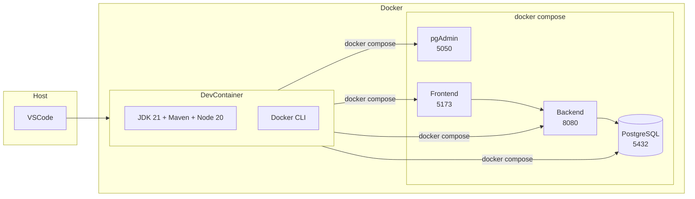

# Docker Development Setup

## Prerequisites

- Docker Engine 24+
- Docker Compose v2

No local Java, Maven, Node.js, or npm installation required.

---

## Quick Start (VSCode Dev Container - Recommended)

1. Open the project folder in VSCode
2. `Ctrl+Shift+P` -> "Dev Containers: Reopen in Container"
3. The container has Java 21, Maven, Node 20, and Docker CLI
4. Open a terminal inside VSCode and run:

```bash
cd infra && docker compose up -d
```

---

## Quick Start (Direct Docker Compose)

```bash
cd infra
docker compose up -d
```

---

## Services

| Service | URL | Credentials |
|---------|-----|-------------|
| Frontend (Vite) | http://localhost:5173 | - |
| Backend API | http://localhost:8080 | - |
| Swagger UI | http://localhost:8080/swagger-ui.html | - |
| pgAdmin | http://localhost:5050 | `admin@delivery.com` / `admin` |
| PostgreSQL | localhost:5432 | `postgres` / `password` |

## Sample Users (dev profile only)

| Role | Email | Password |
|------|-------|----------|
| Admin | `admin@fakedata.com` | (random, check logs) |
| Restaurant | `pizzaria@fakedata.com` | (random, check logs) |

---

## Environment Variables

All configuration is centralized in `.env` at the project root. Copy `.env.example` to `.env` and adjust:

```bash
cp .env.example .env
```

Key variables:

| Variable | Default | Description |
|----------|---------|-------------|
| `DATABASE_URL` | `jdbc:postgresql://localhost:5432/delivery_db` | PostgreSQL JDBC URL |
| `DATABASE_USERNAME` | `postgres` | DB user |
| `DATABASE_PASSWORD` | `password` | DB password |
| `JWT_SECRET` | *(dev default)* | JWT signing key |
| `CORS_ORIGINS` | `http://localhost:5173` | Allowed CORS origins |
| `FRONTEND_URL` | `http://localhost:5173` | Frontend URL for redirects |
| `VITE_APP_API_BASE_URL` | `http://localhost:8080/api` | API URL for frontend |
| `VITE_APP_BACKEND_URL` | `http://localhost:8080` | Backend URL for frontend |

---

## Commands

```bash
# Start all services
cd infra && docker compose up -d

# View logs
docker compose logs -f backend
docker compose logs -f frontend

# Rebuild a service
docker compose build backend
docker compose up -d backend

# Full restart
docker compose down && docker compose up -d

# Reset database (deletes all data)
docker compose down -v && docker compose up -d

# Production mode
docker compose -f docker-compose.prod.yml up -d

# Run backend tests
docker compose exec backend mvn test

# Run frontend tests
docker compose exec frontend npm run test
```

---

## Hot Reload

### Backend (Spring Boot DevTools + inotify)

1. Edit any `.java` file in `backend/src/`
2. `inotifywait` detects the change
3. `mvn compile` recompiles
4. DevTools restarts the app (~1-2s)

### Frontend (Vite HMR)

1. Edit any `.vue`, `.js`, or `.css` file in `frontend/src/`
2. Vite HMR pushes the change to the browser instantly

---

## Architecture



---

## File Structure

```text
backend/
  pom.xml
  scripts/dev-entrypoint.sh
  src/
    main/java/com/delivery/
      config/         # SecurityConfig, WebSocketConfig, DataLoader
      controller/     # REST controllers
      domain/valueobject/  # Cpf, Email
      dto/            # Java Records
      exception/      # ApiError, RestExceptionHandler
      mapper/         # MapStruct interfaces
      model/          # JPA entities
      repository/     # Spring Data JPA
      security/       # JWT, WebSocket auth
      service/        # Business logic
frontend/
  src/
    components/base/      # BaseButton, BaseInput, BaseModal
    components/features/  # CartItemCard, OrderCard, ProductCard
    composables/          # useApi, useAuth, useDebounce
    config/               # env.js
    plugins/              # axios.js
    router/               # index.js, guards.js
    services/             # auth, order, payment, product, user
    stores/               # auth.js, cart.js
    views/                # AppHome, AppCart, CheckoutPix, etc.
infra/
  docker-compose.yml
  docker-compose.prod.yml
  docker/
    backend/Dockerfile
    backend/Dockerfile.dev
    frontend/Dockerfile
    frontend/Dockerfile.dev
```
