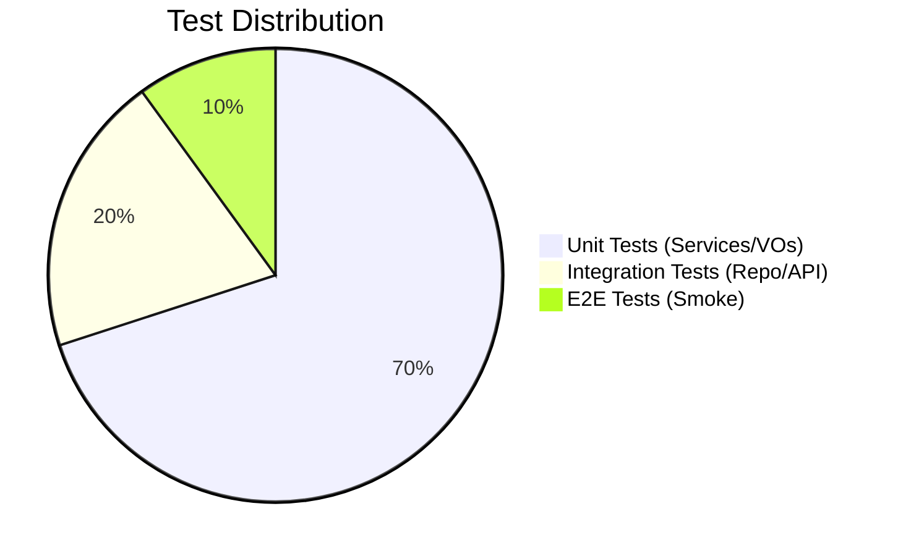

# Testing Guide

## 1. The Testing Pyramid


## 2. Unit Testing (TDD)
- **Frameworks:** JUnit 5, Mockito, AssertJ.
- **Pattern:** Given-When-Then.
```java
@Test
void shouldCreateUserWhenDataIsValid() {
    // Given: Setup mocks and data
    // When: Action
    // Then: Assertion
}
```

## 3. Integration Testing
- **Database:** Use **H2** for fast in-memory testing during build.
- **Context:** Use `@WebMvcTest` for Controller slices.

## 4. Quality Gates
- **Coverage:** Minimum 70% coverage for business logic.
- **Null Safety:** Strict use of `@NonNull` and `Objects.requireNonNull`.