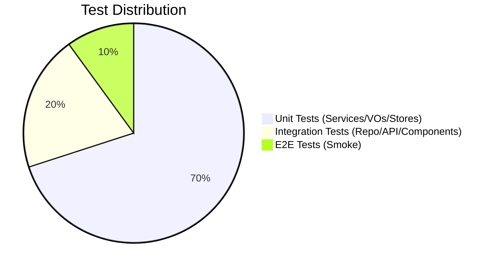

# Testing Guide

## 1. The Testing Pyramid

## 2. Backend Testing (JUnit 5 + Mockito)
- **Service Tests:** Isolate business logic. Use `LENIENT` strictness where necessary.
- **Controller Tests:** Use `@WebMvcTest` and `MockMvc`.
- **Naming:** `should[ExpectedBehavior]When[Condition]`.

## 3. Frontend Testing (Vitest + Vue Test Utils)
- **Structure:** Tests are located in `src/tests/` using `*.test.js` naming.
- **Unit Tests:** Test Pinia stores and logic composables in isolation.
    - Always use `setActivePinia(createPinia())` in `beforeEach`.
- **Component Tests:** Mount components and simulate interactions.
    - Use `data-testid` for resilient element selection.
- **Mocks:** Use `vi.mock` to isolate dependencies (Axios, Router).
- **Commands:**
    - `npm run test`: Run all tests.
    - `npm run test -- --coverage`: Generate coverage report.

## 4. Quality Gates
- **H2 Database:** Used for fast in-memory execution during build.
- **Null Safety:** Strict use of `@NonNull` and validation annotations.
- **TDD:** Write tests before implementation whenever feasible.