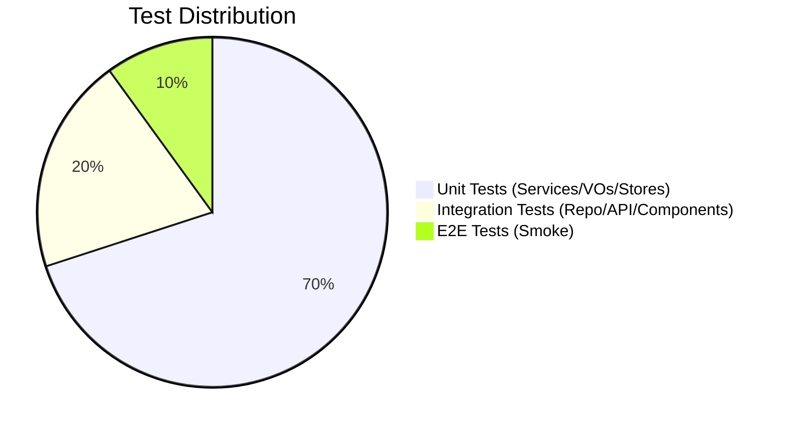

# Testing Guide

## 1. The Testing Pyramid

## 2. Backend Testing (JUnit 5 + Mockito)

- **Service Tests:** Isolate business logic using mocks.
- **Controller Tests:** `@WebMvcTest` with `MockMvc`.
- **Naming:** `should[ExpectedBehavior]When[Condition]`.

## 3. Frontend Testing (Vitest + Vue Test Utils)

- **Structure:** Tests in `src/tests/` with `*.test.js` naming.
- **Unit Tests:** Test Pinia stores and composables in isolation. Use `setActivePinia(createPinia())` in `beforeEach`.
- **Component Tests:** Mount components and simulate interactions.
- **Mocks:** Use `vi.mock` to isolate dependencies (Axios, Router).
- **Commands:**
  - `npm run test`: Run all tests.
  - `npm run test -- --coverage`: Generate coverage report.

## 4. Quality Gates

- **Null Safety:** Strict use of validation annotations.
- **Portfolio context:** The project simulates external services (payment via QR Code link, static map image for tracking) instead of integrating real APIs. Tests reflect these simulated flows.
