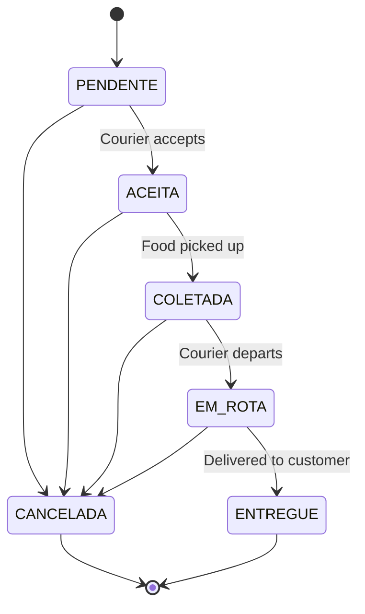

# Delivery Module

## Files

- `controller/DeliveryController.java`: REST controller with endpoints for listing available deliveries, accepting a delivery, updating status, and listing the courier's deliveries.

- `service/DeliveryService.java`: Business logic for delivery lifecycle. Uses atomic `acceptAtomically` query to prevent race conditions when multiple couriers try to accept the same delivery. Publishes `DeliveryUpdatedEvent` after state changes for WebSocket notification (handled by `DeliveryEventListener`).

- `model/Delivery.java`: JPA entity with `@OneToOne` to Order, `@ManyToOne` courier, `DeliveryStatus` enum, BigDecimal `fee`, origin/destination addresses, and timestamps.

- `model/DeliveryStatus.java`: Enum with `PENDENTE, ACEITA, COLETADA, EM_ROTA, ENTREGUE, CANCELADA`.

- `dto/DeliveryResponseDTO.java`: Output DTO with delivery ID, order ID, courier ID, addresses, status, estimated time, fee, and timestamps.

- `repository/DeliveryRepository.java`: Spring Data repository with `findByStatusAndCourierIsNull`, `findByCourier`, and the atomic `acceptAtomically` update query.

- `event/DeliveryUpdatedEvent.java`: Domain event record emitted after delivery state changes.

- `event/DeliveryEventListener.java`: `@TransactionalEventListener(phase = AFTER_COMMIT)` that sends the updated delivery DTO to the STOMP topic `/topic/orders/{orderId}`. This ensures the WebSocket message is only sent after the database transaction commits.

## Design Decisions

- State transitions are validated by a map-based state machine: `PENDENTE -> ACEITA -> COLETADA -> EM_ROTA -> ENTREGUE`. `CANCELADA` is allowed from any state before `ENTREGUE`.
- Delivery acceptance uses an atomic UPDATE query with optimistic locking to handle concurrent courier acceptance.
- WebSocket notifications use `@TransactionalEventListener` to avoid sending notifications for rolled-back transactions.
- The `delivery.service.js` frontend service abstracts the API calls away from Vue components.

## Delivery Status State Machine

