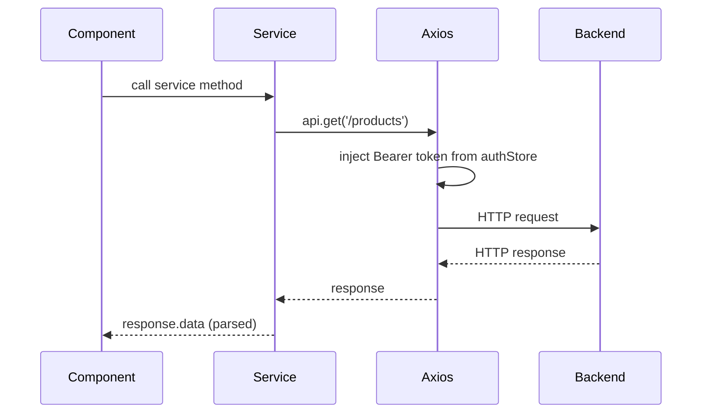

# Frontend Services Module

## Files

- `services/auth.service.js`: Auth API calls (`login`, `getCurrentUser`). Used by `stores/auth.js`.

- `services/establishment.service.js`: Establishment API calls (`getAll`, `getById`, `getProducts`, `getMyEstablishment`).

- `services/order.service.js`: Order API calls (`getAll`, `create`, `getMyOrders`).

- `services/payment.service.js`: Payment API calls (`generatePix`, `getStatus`).

- `services/product.service.js`: Product API calls (`getAll`, `getById`, `create`, `update`, `delete`, `getMyProducts`).

- `services/delivery.service.js`: Delivery API calls (`getAvailable`, `getMine`, `accept`, `updateStatus`).

- `services/user.service.js`: User API calls (`register`, `updateProfile`).

- `plugins/axios.js`: Axios instance with base URL configuration and interceptors for JWT injection (request) and 401 handling (response).

## Design Decisions

- Every HTTP call passes through the services layer. Components never use `axios` directly.
- Service methods return the parsed response data directly (via `response.data`), so callers work with plain objects.
- The `useApi` composable wraps service calls with loading/error state management.
- All API paths omit the `/api` prefix since it is configured in the axios base URL.

## Data Flow

