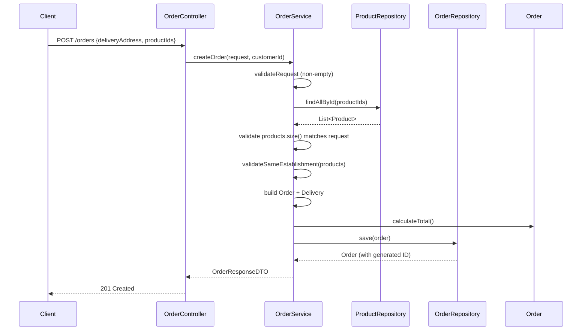
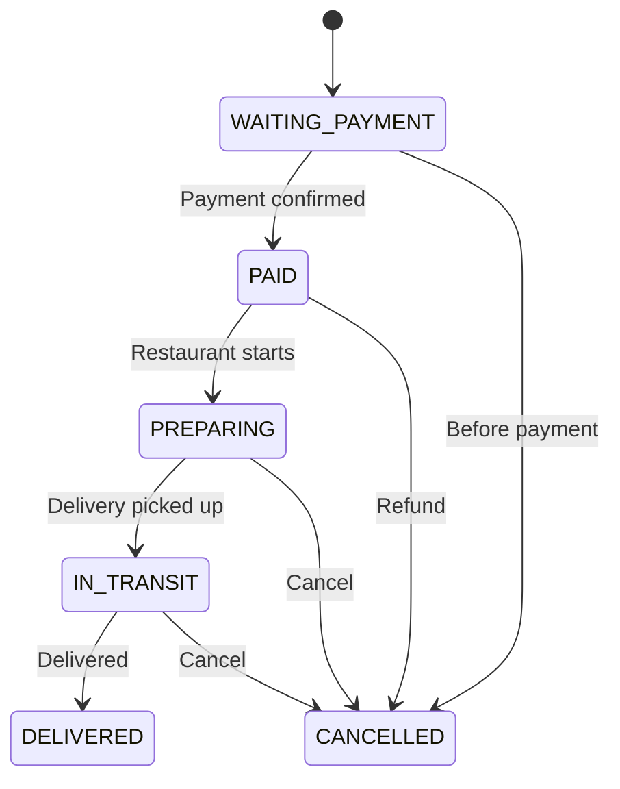

# Order Module

## Files

- `controller/OrderController.java`: REST controller with `POST /api/orders` (authenticated, creates order) and `GET /api/orders/me` (returns current user's orders with eager-loaded products and delivery).

- `service/OrderService.java`: Business logic for order creation. Validates product list (non-empty, all IDs exist, all from same establishment), creates an `Order` with `WAITING_PAYMENT` status, creates a `Delivery` in `PENDENTE` status, and persists everything in one transaction.

- `model/Order.java`: JPA entity with `@ManyToMany` products, `@OneToOne` delivery, BigDecimal `deliveryFee` and `totalValue`, and `@Enumerated(EnumType.STRING) OrderStatus`. `calculateTotal()` sums product prices plus delivery fee.

- `model/OrderStatus.java`: Enum with `WAITING_PAYMENT, PAID, PREPARING, IN_TRANSIT, DELIVERED, CANCELLED`.

- `dto/OrderRequestDTO.java`: Input DTO with `deliveryAddress` and `productIds` list.

- `dto/OrderResponseDTO.java`: Output DTO with all order fields including nested `ProductResponseDTO` list and `DeliveryResponseDTO`.

- `repository/OrderRepository.java`: Spring Data JPA repository with `findByCustomerId` using `@EntityGraph` for products and delivery.

- `mapper/OrderMapper.java`: MapStruct interface mapping `Order` to `OrderResponseDTO`.

## Design Decisions

- `OrderStatus` is a Java enum rather than a free-form string, ensuring type safety and preventing invalid states.
- Each order creates a `Delivery` at the same time, ensuring the delivery tracking is always available from order creation.
- Product IDs are validated to exist in the database before order creation. Duplicate IDs in the request are tolerated (Set comparison).
- Monetary values use `BigDecimal`.
- The `deliveryFee` default is stored in the service constant.

## Order Creation Flow

## State Machine

