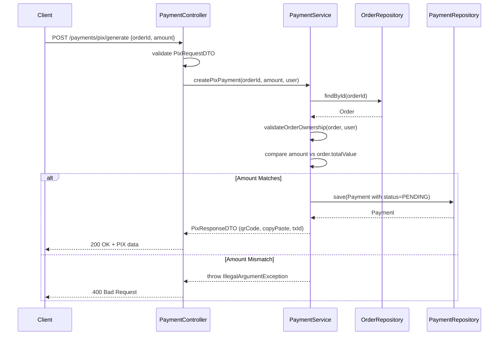

# Payment Module

## Files

- `controller/PaymentController.java`: REST controller exposing `POST /api/payments/pix/generate`, `GET /api/payments/{id}/status`, and `POST /api/payments/confirm/{transactionId}`. All require authentication. The generate endpoint validates the `PixRequestDTO` before calling the service.

- `service/PaymentService.java`: Core business logic for PIX payments. `createPixPayment` validates order ownership and amount matching, creates a `Payment` record with `PENDING` status, and returns mock PIX data (QR code and copy-paste string). `getPaymentStatus` returns current status with ownership checking. `confirmPayment` transitions payment to `CONFIRMED` and updates order status to `PAID`.

- `dto/PixRequestDTO.java`: Input DTO with `orderId` and `amount` (BigDecimal), both `@NotNull`.

- `dto/PixResponseDTO.java`: Output DTO with QR code (base64), copy-paste code, transaction ID, expiration timestamp, and amount.

- `model/Payment.java`: JPA entity with BigDecimal amount, status string, transaction ID, and `@OneToOne` relationship to `Order`.

- `repository/PaymentRepository.java`: Spring Data repository with `findByTransactionId` method.

## Design Decisions

- Monetary values use `BigDecimal` to avoid floating-point precision issues.
- The amount submitted by the client is validated against `order.getTotalValue()` before creating the payment. This prevents client-side tampering with the payment value.
- Payment ownership is verified in both `createPixPayment` (via `validateOrderOwnership`) and `getPaymentStatus` (via customer ID and admin check).
- The system uses mock PIX data (simulated QR code). Replace with a real PIX API integration for production.

## PIX Payment Flow

