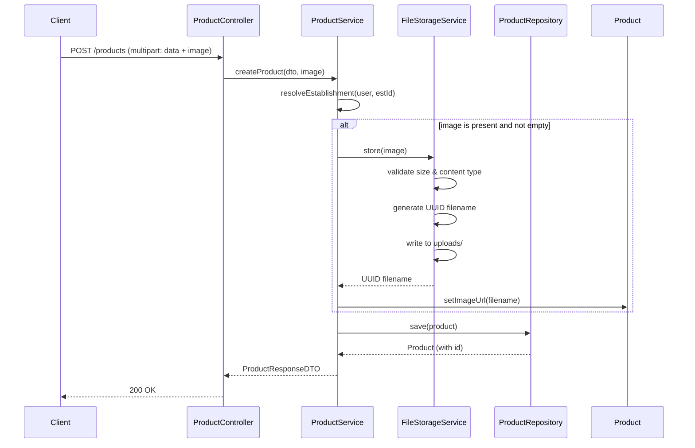

# Product Module

## Files

- `controller/ProductController.java`: REST controller with `GET /api/products` (paginated, with optional `?q=` search), `GET /api/products/{id}`, `POST /api/products` (multipart with image), `PUT /api/products/{id}`, `DELETE /api/products/{id}`. Write operations require `ROLE_ADMIN` or `ROLE_RESTAURANT`.

- `controller/RestauranteController.java`: REST controller for restaurant owners at `/api/restaurant`. Provides `my-establishment`, `my-products`, `products` CRUD. Owns `ROLE_RESTAURANT` scope.

- `service/ProductService.java`: Business logic. `createProduct` resolves the establishment (from user or explicit ID for admins), stores the image via `FileStorageService`, and persists the product. `listAll` and `search` support pagination. `verifyAuthorization` checks that only the owning restaurant or an admin can modify a product.

- `service/FileStorageService.java` / `LocalFileStorageService.java`: Interface and local implementation. `store()` generates a UUID-based filename, validates content type (PNG, JPEG, WebP) via magic bytes check on content-type header, validates file size (max 5MB), and prevents path traversal by normalizing and prefix-checking the path.

- `model/Product.java`: JPA entity with BigDecimal `price`, string `imageUrl` (relative path returned by FileStorageService), and `@ManyToOne` establishment.

- `dto/ProductRequestDTO.java`: Input DTO with `@NotBlank` name/description, `@Positive` BigDecimal price, and optional `establishmentId`.

- `dto/ProductResponseDTO.java`: Output DTO with all product fields (BigDecimal price).

- `repository/ProductRepository.java`: Spring Data repository with `findByEstablishmentId` and `findByNameContainingIgnoreCaseOrDescriptionContainingIgnoreCase` for search.

- `mapper/ProductMapper.java`: MapStruct interface mapping Product <-> DTOs.

## Design Decisions

- Image filenames are UUID-based to prevent path traversal and filename collisions. The original filename from the client is never used in the storage path.
- Content type validation is done via HTTP content-type header, with plans to add actual magic byte detection.
- Pagination and search are server-side to handle growing product catalogs efficiently.
- Product ownership is enforced: a restaurant owner can only manage their own products. Admins can manage all.

## Image Upload Flow

