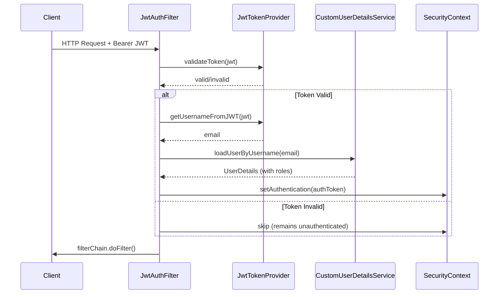

# Security Module

## Files

- `config/SecurityConfig.java`: Spring Security filter chain configuration. Defines public endpoints (auth, products, establishments, Swagger, uploads, WebSocket), role-based access rules for admin/restaurant/delivery endpoints, and Actuator endpoint protection. CORS is configured via the `app.cors.allowed-origins` property, supporting both explicit origins and wildcard pattern matching for `allowCredentials(true)`.

- `config/WebSocketConfig.java`: STOMP/SockJS endpoint registration with configurable allowed origins (read from `app.cors.allowed-origins`). Uses `WebSocketAuthInterceptor` for JWT-based channel authentication.

- `security/JwtTokenProvider.java`: JJWT-based token generation, parsing, and validation. Reads `app.jwt.secret` and `app.jwt.expiration-ms` from properties. The secret key is derived using `Keys.hmacShaKeyFor()`. Tokens include `roles` claim mapping from `GrantedAuthority.getAuthority()`.

- `security/JwtAuthenticationFilter.java`: `OncePerRequestFilter` that extracts Bearer token from the `Authorization` header, validates it, loads the `UserDetails` via `CustomUserDetailsService`, and sets the `SecurityContext`.

- `security/JwtAuthenticationEntryPoint.java`: Returns 401 for unauthenticated requests.

- `security/CustomUserDetailsService.java`: Loads user by email from the database. Uses `@EntityGraph` to eagerly fetch roles for authentication.

- `security/WebSocketAuthInterceptor.java`: Extracts JWT from STOMP `CONNECT` frame's `Authorization` header and validates it before allowing channel subscription.

- `config/SecurityConfig.java` (CORS): Parses `app.cors.allowed-origins` comma-separated list. If any origin equals `*`, uses `allowedOriginPatterns` (required for `allowCredentials(true)` with wildcard). Otherwise uses `allowedOrigins` directly.

- `exception/ApiError.java`: Error response DTO with `@JsonIgnore` on the `exception` field to prevent serializing the raw `Throwable` in HTTP responses. `debugMessage` provides developer-facing details.

- `exception/RestExceptionHandler.java`: Maps exceptions to HTTP statuses: 400 for `IllegalArgument`/validation errors, 404 for not-found, 409 for `IllegalState`/conflict, 403 for security, and a catch-all 500 for unhandled errors.

## Design Decisions

- JWT secret has no fallback in production profile; boot fails if `JWT_SECRET` is not set. Dev and test profiles keep a development secret.
- Actuator exposure is restricted to `health,info`. Sensitive endpoints require `ROLE_ADMIN`.
- File uploads use UUID-based filenames to prevent path traversal. Content type and size are validated.
- CORS is configured per-environment via properties, never hardcoded to `*`.
- Data seeder (`DataLoader`) is annotated `@Profile("dev")` and uses random passwords.

## Authentication Flow

