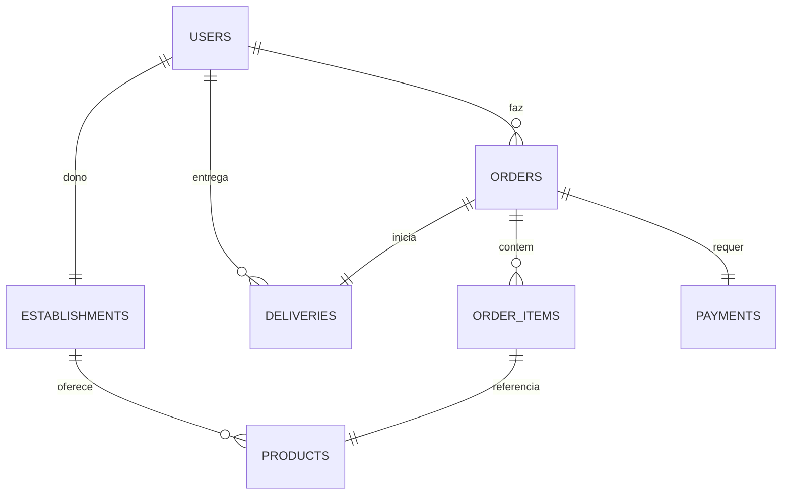

# Arquitetura do Sistema - Delivery System

## 1. Visao Geral Arquitetural

O sistema utiliza **Arquitetura em Camadas** com influencias de **Domain-Driven Design (DDD)**. A logica de negocio e desacoplada da infraestrutura e dos contratos da API.

### 1.1. Fluxo de Alto Nivel

## 2. Detalhes das Camadas

### 2.1. Camada de API (Controllers)

- **Responsabilidade:** Tratar requisicoes HTTP e conexoes WebSocket, validar DTOs de entrada, retornar respostas padronizadas.
- **Contrato:** 100% Ingles para endpoints e chaves JSON.
- **Componentes:** `UserController`, `OrderController`, `ProductController`, `PaymentController`, `DeliveryController`, `EstablishmentController`.

### 2.2. Camada de Servico (Aplicacao)

- **Responsabilidade:** Orquestrar casos de uso, gerenciar transacoes, disparar notificacoes em tempo real via `SimpMessagingTemplate`.
- **Estrategia:** `@Transactional` para operacoes atomicas.

### 2.3. Camada de Dominio (Core)

- **Entidades:** Objetos ricos com logica de negocio (ex: `Order.calculateTotal()`).
- **Value Objects (VOs):** Objetos imutaveis com autovalidacao (`Cpf`, `Email`).
- **Regras:** Regras de negocio residem aqui, nao nos services.

### 2.4. Camada de Persistencia (Repositorios)

- **Tecnologia:** Spring Data JPA + Flyway migrations.
- **Banco:** PostgreSQL 16.

## 3. Arquitetura Frontend (Vue.js 3)

O frontend segue um padrao em camadas para manutenibilidade.

### 3.1. Camadas

- **Services (`/src/services`)**: Unica camada que conhece o Axios. Encapsula chamadas de API.
- **Stores (`/src/stores`)**: Gerencia estado global (Auth, Cart) com Pinia.
- **Composables (`/src/composables`)**: Logica reativa reutilizavel entre componentes.
- **Componentes (`/src/components`)**:
  - **Base:** Elementos atomicos de UI (Botao, Input, Icone).
  - **Layout:** Componentes estruturais (Navbar, Notificacoes).
  - **Features:** Componentes especificos de negocio (Carrinho, Produto, Pedido).

### 3.2. Fluxo de Dados

`Componente` -> `Composable` -> `Store` -> `Service` -> `API`

### 3.3. Seguranca

- **Token JWT:** Armazenado no `sessionStorage` via `storage.js`.
- **Interceptadores:** Axios interceptors anexam token Bearer e tratam erros 401/403.
- **Guardas de Rota:** `authGuard` verifica papeis do usuario (ex: `ROLE_ADMIN`).

## 4. Modelo de Dados (Diagrama ER)

## 5. Tecnologias

- **Backend:** Java 21 (Virtual Threads), Spring Boot 3.4.1, Spring Security, Spring Data JPA, Flyway
- **Frontend:** Vue 3 (Composition API), Vite, Pinia, Axios, SockJS + Stomp (WebSocket)
- **Seguranca:** Spring Security + JWT Stateless (Bearer)
- **Mapeamento:** MapStruct
- **Infraestrutura:** Docker, PostgreSQL 16
