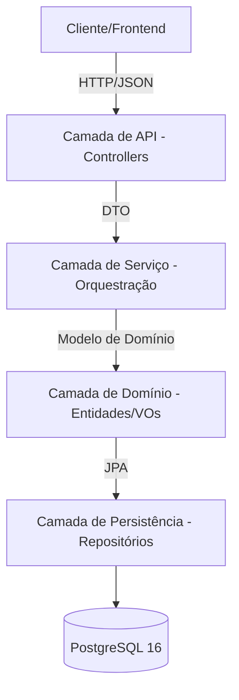

# Arquitetura do Sistema - Delivery System

## 1. Visão Geral Arquitetural
O sistema utiliza uma **Arquitetura em Camadas** com influências de **Domain-Driven Design (DDD)**. Priorizamos o desacoplamento da lógica de negócio em relação à infraestrutura e aos contratos da API.

### 1.1. Fluxo de Alto Nível

## 2. Detalhes das Camadas

### 2.1. Camada de API (Controllers)
- **Responsabilidade:** Tratar requisições HTTP, validar DTOs de entrada e retornar respostas padronizadas.
- **Componentes:** `UserController`, `OrderController`, `ProductController`, etc.

### 2.2. Camada de Serviço (Aplicação)
- **Responsabilidade:** Orquestrar casos de uso. Interage com repositórios e gerencia transações.
- **Estratégia de Transação:** O uso de `@Transactional` garante operações atômicas.

### 2.3. Camada de Domínio (Core)
- **Entidades:** Objetos ricos com lógica (ex: `Order.calculateTotal()`).
- **Value Objects (VOs):** Objetos imutáveis com auto-validação (`Cpf`, `Email`).
- **Regras:** As regras de negócio devem residir aqui, não nos Services.

## 3. Modelo de Dados (Diagrama ER)

## 4. Tecnologias
- **Runtime:** Java 21 (Virtual Threads habilitadas).
- **Framework:** Spring Boot 3.4.1.
- **Segurança:** Spring Security + JWT Stateless.
- **Mapeamento:** MapStruct 1.6.3.