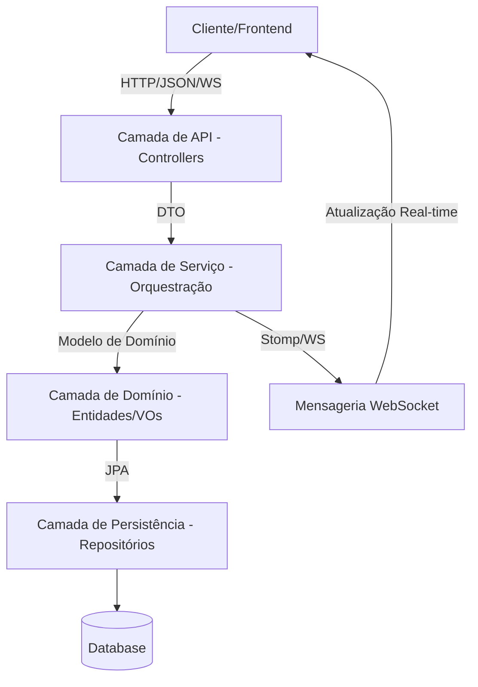
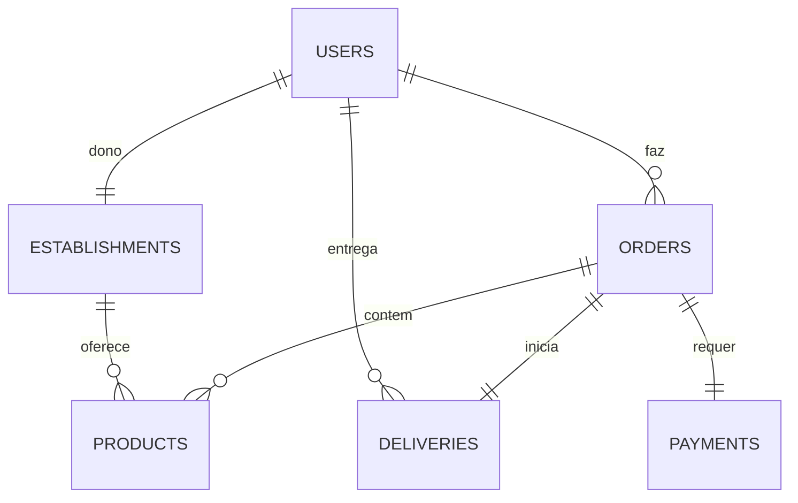

# Arquitetura do Sistema - Delivery System

## 1. Visão Geral Arquitetural
O sistema utiliza uma **Arquitetura em Camadas** com influências de **Domain-Driven Design (DDD)**. Priorizamos o desacoplamento da lógica de negócio em relação à infraestrutura e aos contratos da API.

### 1.1. Fluxo de Alto Nível

## 2. Detalhes das Camadas

### 2.1. Camada de API (Controllers)
- **Responsabilidade:** Tratar requisições HTTP e conexões WebSocket, validar DTOs de entrada e retornar respostas padronizadas.
- **Contrato:** Nomenclatura 100% em Inglês para endpoints e chaves JSON.
- **Componentes:** `UserController`, `OrderController`, `ProductController`, `PaymentController`, `DeliveryController`.

### 2.2. Camada de Serviço (Aplicação)
- **Responsabilidade:** Orquestrar casos de uso. Interage com repositórios, gerencia transações e dispara notificações em tempo real via `SimpMessagingTemplate`.
- **Estratégia de Transação:** O uso de `@Transactional` garante operações atômicas.

### 2.3. Camada de Domínio (Core)
- **Entidades:** Objetos ricos com lógica (ex: `Order.calculateTotal()`).
- **Value Objects (VOs):** Objetos imutáveis com auto-validação (`Cpf`, `Email`).
- **Regras:** As regras de negócio residem aqui, não nos Services.

### 2.4. Camada de Persistência (Repositórios)
- **Tecnologia:** Spring Data JPA.
- **Responsabilidade:** Abstrair o acesso ao banco. Suporta PostgreSQL (Produção) e H2 (Desenvolvimento Local).

## 3. Arquitetura Frontend (Vue.js 3)
O frontend segue o padrão de **Arquitetura Clean Frontend**, organizada em camadas para garantir manutenibilidade:

### 3.1. Camadas
- **Services (`/src/services`)**: Única camada que conhece o Axios. Encapsula as chamadas de API e garante dados padronizados.
- **Stores (`/src/stores`)**: Gerencia o estado global (Auth, Cart) usando Pinia. Evita lógica complexa de DOM.
- **Composables (`/src/composables`)**: Lógica reativa reutilizável entre componentes (ex: useAuth, useApi, useWebSocket).
- **Componentes (`/src/components`)**:
    - **Base:** Elementos atômicos de UI (Botão, Input, Ícone).
    - **Layout:** Componentes estruturais (Navbar, Footer, Notificações).
    - **Features:** Componentes específicos de negócio (Carrinho, Produto, Pedido).

### 3.2. Fluxo de Dados
`Componente` -> `Composable` -> `Store` -> `Service` -> `API`

### 3.3. Segurança
- **Armazenamento de Tokens**: O JWT é armazenado no `sessionStorage` via utilitário `storage.js`. Isso mitiga riscos de XSS ao não persistir dados sensíveis no disco.
- **Interceptores**: Interceptores do Axios anexam automaticamente o token Bearer e tratam erros 401/403 disparando logout e redirecionamento.
- **Gestão de Permissões**: O acesso a rotas é controlado por um `authGuard` que verifica os papéis do usuário (ex: `ROLE_ADMIN`).

## 4. Modelo de Dados (Diagrama ER)

## 5. Tecnologias
- **Backend:** Java 21 (Virtual Threads), Spring Boot 3.4.1, Flyway.
- **Frontend:** Vue 3 (Composition API), Vite, Pinia, Axios, SockJS + Stomp (WebSocket).
- **Segurança:** Spring Security + JWT Stateless (Bearer).
- **Mapeamento:** MapStruct 1.6.3.