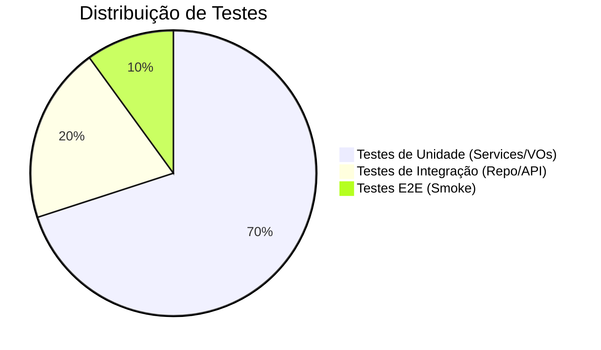

# Guia de Testes

## 1. A Pirâmide de Testes

## 2. Testes de Unidade (TDD)
- **Frameworks:** JUnit 5, Mockito, AssertJ.
- **Padrão:** Given-When-Then.

## 3. Testes de Integração
- **Banco de Dados:** Use **H2** para execução rápida durante o build.
- **Contexto:** Use `@WebMvcTest` para testes isolados de Controllers.

## 4. Quality Gates
- **Cobertura:** Mínimo de 70% em lógica de negócio.
- **Null Safety:** Uso rigoroso de `@NonNull` e `Objects.requireNonNull`.