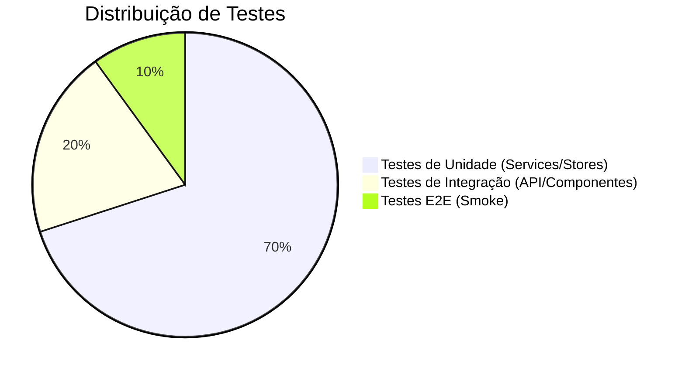

# Guia de Testes

## 1. A Pirâmide de Testes

## 2. Testes Backend (JUnit 5 + Mockito)
- **Services:** Isolar a lógica de negócio com mocks. Usar `LENIENT` quando necessário.
- **Controllers:** Usar `@WebMvcTest` e `MockMvc`.
- **Padrão:** `should[ExpectedBehavior]When[Condition]`.

## 3. Testes Frontend (Vitest + Vue Test Utils)
- **Estrutura:** Testes em `src/tests/` com nomenclatura `*.test.js`.
- **Testes de Unidade:** Testar stores Pinia e composables de lógica em isolamento.
    - Sempre usar `setActivePinia(createPinia())` no `beforeEach`.
- **Testes de Componente:** Montar componentes e simular interações.
    - Usar `data-testid` para seleção resiliente de elementos.
- **Mocks:** Usar `vi.mock` para isolar dependências (Axios, Router).
- **Comandos:**
    - `npm run test`: Executa todos os testes.
    - `npm run test -- --coverage`: Gera relatório de cobertura.

## 4. Quality Gates
- **Banco H2:** Usado para execução rápida em memória.
- **Null Safety:** Uso rigoroso de `@NonNull` e anotações de validação.
- **TDD:** Escrever testes antes da implementação sempre que possível.